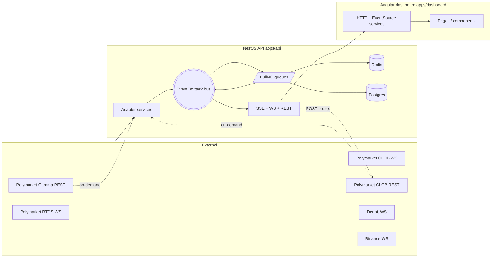
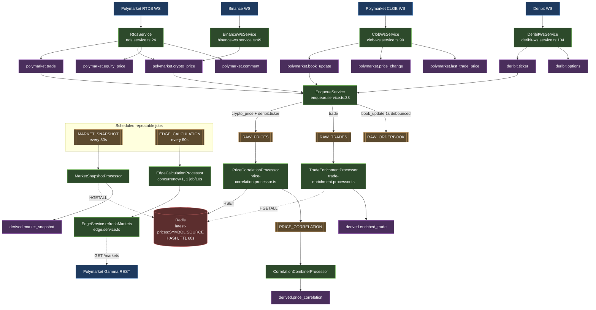
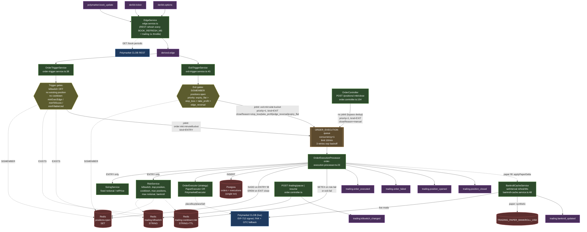
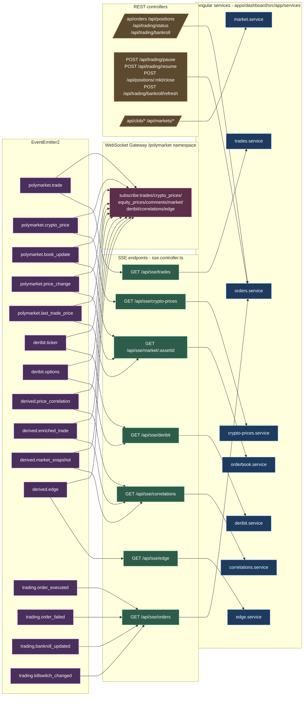
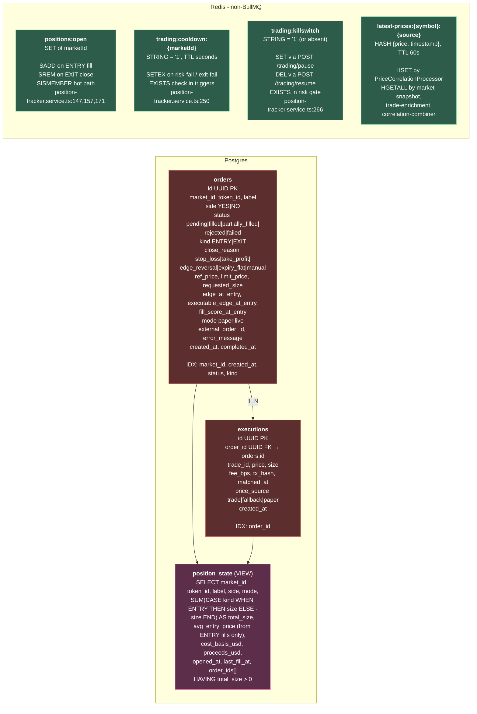

# Data Flow

How a byte travels from an external source to the dashboard — and back into an order on Polymarket.

Every annotation uses `file:line` so you can cmd-click straight to the source in VS Code.

---

## 1. System overview

---

## 2. Ingest & derivation pipeline

Raw market data → events → BullMQ queues → derived events.

**What the derivation layer does in one sentence:** merge fresh BTC/ETH prices from multiple sources via Redis staging so every downstream consumer (correlation, snapshot, trade enrichment, edge) sees a single-writer latest-price view.

---

## 3. Edge → Trading pipeline

How an edge signal becomes an actual order, with all safety gates and storage side-effects.

**Dedup semantics in one sentence:** entries dedupe per-minute-per-market to avoid spamming fills while an edge persists; auto-exits dedupe per-cooldown-bucket-per-side so a thrashy book can't fire a hundred closes while one is still in flight; manual close skips dedup entirely because operator intent always wins.

---

## 4. Outbound distribution

Events → SSE / WS / REST → dashboard services.

> **Every SSE endpoint** also emits a `keepalive` event every 15 s (`sse.controller.ts:207`) so the dashboard's 30 s staleness-check doesn't false-trip during quiet periods — the dashboard surfaces this as the `LIVE` / `DISCONNECTED` badge on `/orders`.

---

## 5. Storage layout

Migrations live in `apps/api/src/database/migrations/`:

- `001_orders.sql` — base schema + `position_state` view
- `002_exit_orders.sql` — adds `kind` + `close_reason`; rewrites `position_state` VIEW to net ENTRY - EXIT fills

---

## Reference — EventEmitter2 events

Constants in `libs/shared-types/src/lib/events.ts`.

| Event | Emitted by | Notes |
|---|---|---|
| `polymarket.trade` | `rtds.service.ts:120` | Raw Polymarket trades |
| `polymarket.order_matched` | `rtds.service.ts:122` | CLOB match notifications |
| `polymarket.crypto_price` | `rtds.service.ts:127`, `binance-ws.service.ts:92` | BTC/ETH reference prices |
| `polymarket.equity_price` | `rtds.service.ts:130` | Equity indices |
| `polymarket.comment` | `rtds.service.ts:133` | Market comments |
| `polymarket.book_update` | `clob-ws.service.ts:130` | L2 orderbook deltas |
| `polymarket.price_change` | `clob-ws.service.ts:133` | Top-of-book price changes |
| `polymarket.last_trade_price` | `clob-ws.service.ts:136` | Last-trade ticker |
| `polymarket.tick_size_change` | `clob-ws.service.ts:138` | Tick-size updates |
| `polymarket.rtds.status` | `rtds.service.ts:36` | WS health beacon |
| `polymarket.clob_ws.status` | `clob-ws.service.ts:102,113` | WS health beacon |
| `deribit.ticker` | `deribit-ws.service.ts:211` | Perpetual/option mark |
| `deribit.options` | `deribit-ws.service.ts:232` | Greeks + IV |
| `deribit.status` | `deribit-ws.service.ts:114,125` | WS health beacon |
| `derived.price_correlation` | `correlation-combiner.processor.ts` | BTC/ETH cross-source correlation |
| `derived.enriched_trade` | `trade-enrichment.processor.ts:40` | Trade + reference price |
| `derived.market_snapshot` | `market-snapshot.processor.ts:42` | 30 s market roll-up |
| `derived.edge` | `edge.service.ts` | Per-market edge + book depth |
| `trading.order_intent` | `order-trigger.service.ts:101` | ENTRY intent enqueue notification |
| `trading.exit_intent` | `exit-trigger.service.ts:187`, `order.controller.ts:152` | EXIT intent enqueue |
| `trading.order_executed` | `order-execution.processor.ts:142,204` | Fill (ENTRY or EXIT) |
| `trading.order_failed` | `order-execution.processor.ts:149,238` | Order rejected |
| `trading.position_opened` | `order-execution.processor.ts:143` | First ENTRY fill |
| `trading.position_closed` | `order-execution.processor.ts:205` | Fully-closed EXIT |
| `trading.killswitch_changed` | `order.controller.ts:69,78` | Pause/resume toggle |
| `trading.bankroll_updated` | `bankroll-cache.service.ts:72,139,202` | Balance refresh |

---

## Reference — BullMQ queues

Constants in `libs/shared-types/src/lib/queues.ts`.

| Queue | Producer | Processor | Concurrency / limit / retry |
|---|---|---|---|
| `RAW_PRICES` | `enqueue.service.ts:38,50` (on crypto_price + deribit.ticker) | `price-correlation.processor.ts:14` | default concurrency; job removal: age 300 s / 1000 on complete |
| `RAW_TRADES` | `enqueue.service.ts:62` (on polymarket.trade) | `trade-enrichment.processor.ts:11` | default; age 3600 s / 5000 on complete |
| `RAW_ORDERBOOK` | `enqueue.service.ts:70` (1 s debounce per asset_id) | consumed internally for snapshot | — |
| `PRICE_CORRELATION` | `price-correlation.processor.ts:77` | `correlation-combiner.processor.ts` | default |
| `MARKET_SNAPSHOT` | `enqueue.service.ts:23` (repeatable, 30 s) | `market-snapshot.processor.ts:11` | default |
| `EDGE_CALCULATION` | `enqueue.service.ts:30` (repeatable, 60 s) | `edge-calculation.processor.ts:7` | **concurrency 1, 1 job / 10 s** |
| `ORDER_EXECUTION` | `order-trigger.service.ts:103`, `exit-trigger.service.ts:189`, `order.controller.ts:154` | `order-execution.processor.ts:23` | **concurrency 1, 10 jobs / 60 s, 3 retries exp backoff (2 s base)** |

Dedup:
- **ENTRY** jobs — `jobId = order:{marketId}:{minuteBucket}` (one per market per minute)
- **Auto-EXIT** jobs — `jobId = exit:{marketId}:{side}:{exitCooldownBucket}`, `priority=1`
- **Manual close** — no `jobId` (operator always wins), `priority=1`

---

## Reference — Redis keys (non-BullMQ)

| Key | Type | Writer | Reader | TTL |
|---|---|---|---|---|
| `positions:open` | SET | `position-tracker.service.ts:147` (SADD on ENTRY), `:157` (SREM on EXIT close) | `:171` (SISMEMBER), `:176` (SCARD), `order-trigger.service.ts`, `exit-trigger.service.ts` | none |
| `trading:cooldown:{marketId}` | STRING | `position-tracker.service.ts:250` (SET EX), `order-execution.processor.ts:96,145,210` | `order-trigger.service.ts`, `exit-trigger.service.ts` | `cfg.risk.marketCooldownSec` (ENTRY fail) / `cfg.exits.exitCooldownSec` (EXIT fail) |
| `trading:killswitch` | STRING | `position-tracker.service.ts:266` (SET=1 on pause), `:268` (DEL on resume) | `order.controller.ts:54`, risk gate | none |
| `latest-prices:{symbol}:{source}` | HASH `{price, timestamp}` | `price-correlation.processor.ts:51` (HSET) | `market-snapshot.processor.ts:51`, `trade-enrichment.processor.ts:48`, `correlation-combiner.processor.ts:77` | 60 s |

---

## Reference — Postgres tables, SSE endpoints, dashboard services

### Postgres (`apps/api/src/database/migrations/*.sql`)

| Object | Role | Writers | Readers |
|---|---|---|---|
| `orders` table | Append-only intent + outcome log | `position-tracker.service.ts:88` (INSERT) | `order.controller.ts` (`GET /orders`) |
| `executions` table | Append-only fills | `position-tracker.service.ts:120` (INSERT, same txn as orders) | join in `position_state` view |
| `position_state` VIEW | Net open position with ENTRY − EXIT math | (derived) | `position-tracker.service.ts:152`, `order.controller.ts` (`GET /positions`, risk checks) |

### SSE endpoints (`apps/api/src/polymarket/sse/sse.controller.ts`)

| Path | Dashboard consumer | Event types emitted |
|---|---|---|
| `GET /api/sse/trades` | `trades.service.ts` | `polymarket.trade` + `keepalive` |
| `GET /api/sse/crypto-prices` | `crypto-prices.service.ts` | `polymarket.crypto_price` + `keepalive` |
| `GET /api/sse/market/:assetId` | `orderbook.service.ts` | `polymarket.book_update`, `polymarket.price_change`, `polymarket.last_trade_price` + `keepalive` |
| `GET /api/sse/deribit` | `deribit.service.ts` | `deribit.ticker`, `deribit.options` + `keepalive` |
| `GET /api/sse/correlations` | `correlations.service.ts` | `derived.price_correlation`, `derived.enriched_trade`, `derived.market_snapshot` + `keepalive` |
| `GET /api/sse/edge` | `edge.service.ts` | `derived.edge` + `keepalive` |
| `GET /api/sse/orders` | `orders.service.ts` | `order_executed`, `order_failed`, `bankroll`, `killswitch` + `keepalive` |

### REST endpoints (non-SSE)

| Path | Handler |
|---|---|
| `GET /api/orders` (limit) | `order.controller.ts` |
| `GET /api/positions` | `order.controller.ts` |
| `GET /api/trading/status` | `order.controller.ts` |
| `GET /api/trading/bankroll` | `order.controller.ts` |
| `POST /api/trading/pause` | `order.controller.ts` |
| `POST /api/trading/resume` | `order.controller.ts` |
| `POST /api/trading/bankroll/refresh` | `order.controller.ts` |
| `POST /api/positions/:marketId/close` | `order.controller.ts:154` (enqueue EXIT intent) |
| `GET /api/clob/{book,price,midpoint,spread,last-trade-price}/:tokenId` | `clob-rest.controller.ts` |
| `GET /api/markets`, `/api/markets/:slug`, `/api/markets/search/:q` | `gamma.controller.ts` |
| `GET /api/health` | `health.controller.ts` |

---

## Tracing example — paper-mode edge → filled order

Follow one signal end-to-end:

1. Deribit WS pushes BTC ticker → `DeribitWsService` emits `deribit.ticker`.
2. `EdgeService` recomputes edge for every tracked Polymarket market using cached CLOB book + Deribit option surface → emits `derived.edge`.
3. `OrderTriggerService.onEdge` checks gates (killswitch off via `trading:killswitch`, no position via `SISMEMBER positions:open`, no cooldown via `EXISTS trading:cooldown:mkt`, exec-edge/fillScore/fillableUsd thresholds).
4. Passes → enqueues `jobId=order:mkt:minuteBucket` with `kind=ENTRY` on `ORDER_EXECUTION`.
5. `OrderExecutionProcessor` (concurrency=1) picks up → `SizingService` → `RiskService` (max positions, notional, bankroll) → `PaperExecutor.placeBuy` (synthetic fill at `refPrice`).
6. Postgres single txn: INSERT `orders` (status=`filled`, kind=`ENTRY`) + INSERT `executions`.
7. Redis: SADD `positions:open`. Paper bankroll decrements via `BankrollCacheService.applyPaperDelta(-notional)`.
8. Emits `trading.order_executed` + `trading.position_opened`.
9. `SseController` sees `trading.order_executed` → pushes on `/api/sse/orders`.
10. Dashboard `orders.service.ts` EventSource → `orders.component.ts` prepends row, refreshes positions table.

The same trace in reverse for manual close: dashboard POSTs `/api/positions/:mkt/close` → controller enqueues EXIT with `kind=EXIT, closeReason=manual, priority=1, no jobId` → processor runs `placeSell` path → `SREM positions:open` on full close → `trading.position_closed` → SSE → dashboard row disappears.
